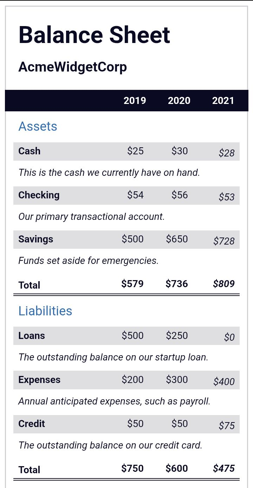

# 💰 Balance Financiero


Aplicación web simple para registrar ingresos y gastos y visualizar el balance total de manera automática.

---

## 🚀 Demo

🔗 **Ver aplicación funcionando**

[](https://carlosdm121.github.io/balancefinanciero/)

---

## 🖼 Vista del proyecto



---

## 🛠 Tecnologías utilizadas

<p>

</p>

- HTML5
- CSS3
- JavaScript

---

## 📂 Características

✔ Registro de ingresos  
✔ Registro de gastos  
✔ Cálculo automático del balance  
✔ Interfaz simple y rápida  
✔ Aplicación ligera sin frameworks

---

## 📦 Instalación

1. Clonar el repositorio

```bash
git clone https://github.com/carlosdm121/balancefinanciero.git
```

2. Abrir la carpeta del proyecto

3. Ejecutar el archivo:

```
index.html
```

---

## 👨‍💻 Autor

Proyecto creado por **Carlos Daniel Martínez**

🔗 GitHub:  
https://github.com/carlosdm121
